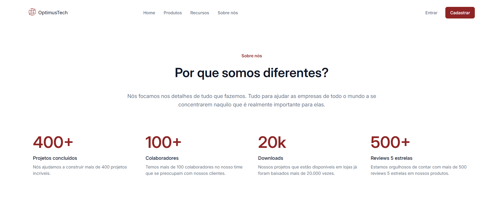

# 7DaysOfCode

O [Figma dessa aplicação você encontra aqui](https://www.figma.com/design/mm3MLozvUDGhDRTxSLlGL5/7daysOfCode-HTML-CSS?node-id=0-1&p=f&t=3TNOHqmZWKQxk25Y-0).

## ✔️ Técnicas e tecnologias utilizadas

Se liga nessa lista de tudo que usei nesse curso:

- `HTML`
- `CSS`
- `Figma`
- `Git e Github`

Fiz essa página completamente do 0, utilizei parte de todo meu aprendizado em HTML e CSS obtidos através da plataforma de cursos [Alura](https://www.alura.com.br/).

## 🛠️ Abrir e rodar o projeto

Para abrir e rodar o projeto, utilize um editor de código de sua escolha.

Depois, abra o projeto no seu navegador. 

## 📚 Mais informações do projeto

Esse projeto é na verdade um desafio do [7DaysOfCode](https://7daysofcode.io/#all), uma plataforma da [Alura ](https://www.alura.com.br/)com diversos desafios relacionados a desenvolvimento WEB e diversas outras tecnologias. Esse desafio em específico foi criado para colocar em prática HTML e CSS.

OptimusTech é uma empresa fictícia de TI sem nenhum vínculo comercial, esta página é destinada a novas contratações. 